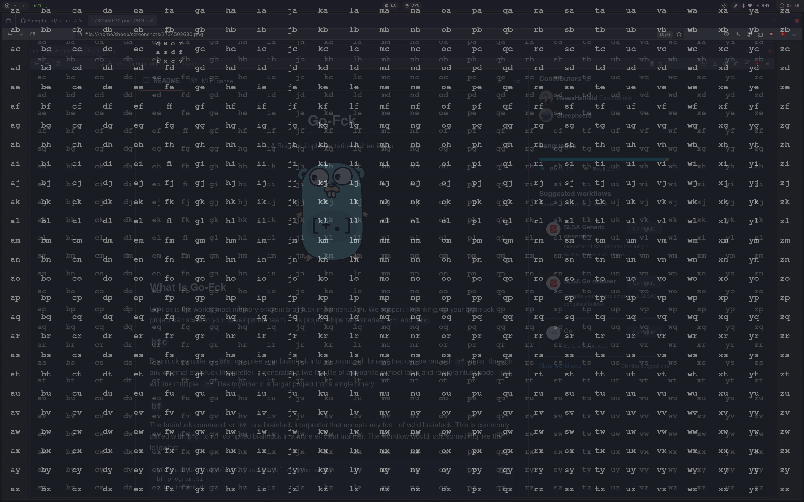

# mousefree
A mouse replacer for wayland

## Getting Started

If on nixos, a devenv.nix shell has been provided with the necessary packages for your system. For others, the requirements.txt file should have all the necessary python libraries, however there are some system packages that must be installed. 

### Pre-requisites

- gtk3
- cairo
- gtk-layer-shell
- libgirepository
- gobject-introspection
- gobject-introspection-runtime
- python
- pkgconf

- hyprland
- ydotool with daemon running

The `run.sh` script can be ran to create a venv and automatically run the script once the above dependencies are installed.

## How Does it Work

Using the [Fabric](https://github.com/Fabric-Development/fabric) framework, gtk Labels can be placed inside of a Fixed Window. Thw window will inherit from a gtk WaylandWindow so that it will overlay the screen. As the window is open, it will be listening for input. Using the hyprctl, the mouse can moved based which two letters the user inputed. After the mouse has moved, the window will still be opened, so the program will not be able to click without simply clicking on the overlay. To solve this, the program closes with an exit code that tells the bash script to execute a ydotool command to click where the user's cursor is pointing

## Demonstration

